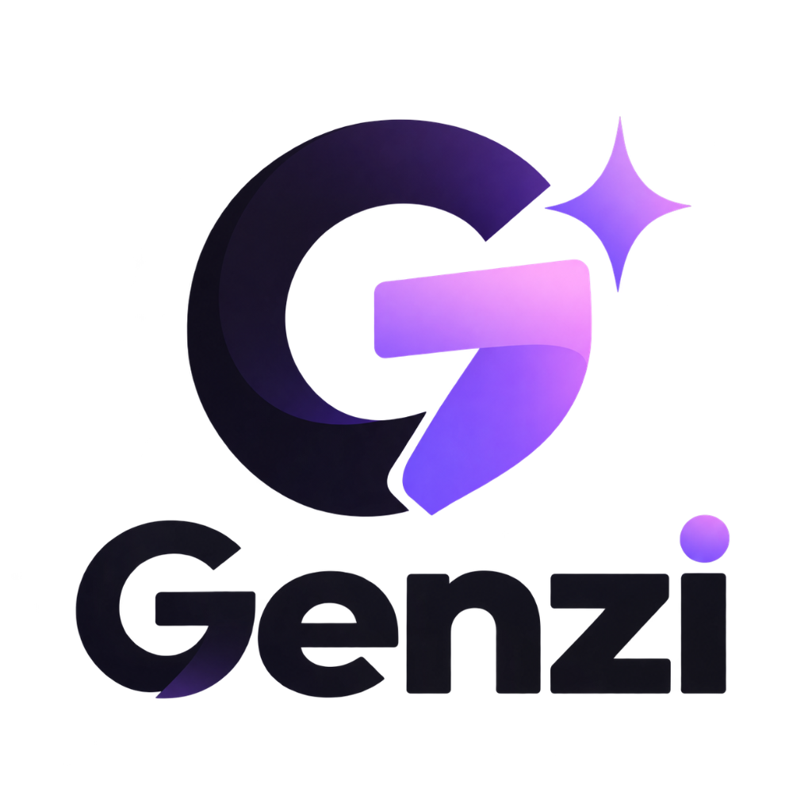

<div align="center">



# Genzi

**Genzi adalah koentji.**

Skill untuk AI coding agent yang bekerja seperti satu tim kecil: bertanya kalau instruksi belum jelas, mendesain dengan karakter, menulis kode yang aman, lalu mengaudit hasilnya sendiri sebelum bilang "selesai".

<br>

[](https://github.com/Naff-Dev/genzi-skill/stargazers)
[](https://github.com/Naff-Dev/genzi-skill/network/members)
[](https://github.com/Naff-Dev/genzi-skill/releases)
[](https://github.com/Naff-Dev/genzi-skill)

[](LICENSE)
[](https://github.com/Naff-Dev/genzi-skill/commits)
[](https://github.com/Naff-Dev/genzi-skill/issues)


[**Coba sekarang**](#-coba-dalam-30-detik) · [**Cara kerja**](#-cara-kerja) · [**6 Hard Blocker**](#-enam-hard-blocker) · [**Instalasi**](#-instalasi-permanen) · [**FAQ**](#-faq)

</div>

---

## Kenapa Genzi ada

Minta AI bikin landing page, hasilnya hampir selalu sama: hero di tengah, tiga kartu fitur, gradient ungu-biru, icon lingkaran di tiap kartu, kata-kata basi seperti *"Unleash your workflow"*, font bawaan browser. Rapi, tapi hambar dan kelihatan banget buatan mesin.

Masalahnya tidak berhenti di tampilan. Agent sering menebak saat instruksi kurang jelas, menaruh token di tempat yang salah, lupa menangani state error, tidak peduli SEO atau Core Web Vitals, dan baru ketahuan rusak waktu dibuka di layar mobile atau ada teks panjang masuk ke komponen.

Genzi dibuat untuk menutup semua itu. Sebelum menulis kode, agent dipaksa tahu dulu produknya untuk siapa dan apa yang belum jelas (dan **bertanya** kalau memang krusial, termasuk preferensi icon SVG vs library). Desainnya dipandu Domain Personality Matrix agar punya jiwa dan tidak generik. Sesudah menulis, dia mengaudit hasilnya sendiri terhadap enam aturan wajib. Kalau satu saja gagal, task belum dianggap selesai.

---

## ⚡ Coba dalam 30 detik

Tidak perlu install apa-apa. Paste satu baris ini ke agent kamu:

```text
use Naff-Dev/genzi-skill [tulis task kamu di sini]
```

Contoh yang bisa langsung dicopy:

```text
use Naff-Dev/genzi-skill buatkan landing page untuk aplikasi food delivery lokal, target ibu rumah tangga kota tier 2
```

```text
use Naff-Dev/genzi-skill build a POS cashier app with daily sales report and inventory tracking
```

```text
use Naff-Dev/genzi-skill redesign dashboard ini agar lebih visual, bold, dan responsive
```

<details>
<summary><b>Agent kamu tidak paham format <code>use ...</code>? Pakai prompt lengkap ini</b></summary>

<br>

Ganti bagian `Task:` lalu paste ke chat agent apa saja (Antigravity, Cursor, Claude Code, Windsurf, Copilot, ChatGPT, dll):

```text
Gunakan skill dari repo ini: https://github.com/Naff-Dev/genzi-skill

Instruksi untuk Agent:
1. Ambil atau baca skill Genzi dari https://github.com/Naff-Dev/genzi-skill
2. Baca file skills/genzi/SKILL.md secara penuh sebelum melakukan coding apapun.
3. Ikuti 18-step workflow yang ada di dalamnya secara lengkap tanpa skip (Requirements Classification, PRD, Bold & Intentional Design dengan HSL spesifik & named fonts, Motion Animation, Architecture, Desktop + Mobile Responsive Verification, dan Self-Review).
4. Baca referensi pendukung di skills/genzi/references/ sesuai fase yang sedang dikerjakan.

Task: [Tulis kebutuhan aplikasi / website / fitur yang mau kamu buat di sini]
```

</details>

<details>
<summary><b>Mode khusus: desain saja, atau review saja</b></summary>

<br>

**Hanya arah desain dan visual:**

```text
use Naff-Dev/genzi-skill design-only: [deskripsi produk atau fitur]
```

**Audit hasil kode dan desain** (dicek terhadap `review-checklist.md`):

```text
use Naff-Dev/genzi-skill review: audit project ini menggunakan checklist skills/genzi/references/review-checklist.md
```

</details>

---

## 🧠 Cara kerja

Genzi merangkap enam peran sekaligus, jadi agent tidak langsung loncat ke kode.

| Peran | Tugasnya |
|---|---|
| **Product Manager** | Mengubah permintaan yang masih kabur jadi requirement konkret. Bertanya kalau ada ambiguitas penting. |
| **UX & Motion Designer** | Merancang mode permukaan (visitor surface mode), alur, motion thesis, micro-interaction, dan kontinuitas spasial. |
| **Art Director** | Menentukan identitas visual yang berani, tipografi berkarakter, dan standar craft floor. |
| **Security Architect** | Menjaga baseline OWASP, validasi skema input, pencegahan XSS/injeksi, dan isolasi rahasia. |
| **Senior Engineer** | Menulis kode yang aman, modular, strictly-typed, punya error boundary, dan gampang dirawat. |
| **Code Reviewer** | Mengaudit hasil kerjanya sendiri terhadap 5 hard blocker sebelum task dinyatakan selesai. |

```text
Request mentah → Intent + Clarification Gate (tanya kalau belum jelas) → Requirements →
PRD (Security & Motion) → Design Craft Floor → Motion System → Arsitektur aman →
Implementasi defensif → Verifikasi (Mobile / Desktop / State) → Selesai
```

### Yang bikin Genzi beda

<table>
<tr>
<td width="50%" valign="top">

**🙋 Clarification Gate**
Kalau ada ambiguitas soal arsitektur, auth, atau scope, agent berhenti dan bertanya secara terstruktur. Tidak menebak.

**📋 Requirements jelas**
Setiap kebutuhan diklasifikasi: Explicit, Inferred, Assumption, atau Unknown.

**📝 PRD yang ikut ukuran task**
Dari Micro PRD sampai Full PRD, lengkap dengan visitor surface mode, threat model, motion thesis, dan arsitektur kode.

**🔐 Baseline OWASP**
Validasi input ketat (Zod/Valibot), proteksi XSS dan SQL injection, token di HttpOnly cookie, tidak ada secret bocor ke client.

</td>
<td width="50%" valign="top">

**🧱 Arsitektur kode yang aman**
Strict TypeScript, discriminated union untuk state machine async, layer yang terpisah, dan error boundary.

**💥 Chaos hardening & Ergonomi Mobile**
Tahan input ekstrem (100+ karakter, CJK, RTL), overflow teks ditangani (`min-width: 0`), dan touch target minimal 44x44px di layar mobile.

**🎨 Desain berkarakter (Anti-AI Cliché)**
Sesuai Domain Personality Matrix, tipografi berkarakter (Google Fonts / local), warna saturated, icon SVG bespoke langsung, dan browser surface di-theme (`::selection`, `caret-color`, `:focus-visible`, scrollbar).

**🎬 Motion 4-Layer yang dirancang**
Focal hero moment, scrollytelling teratur (maks 6 item), micro-interaction taktil (press scale 0.97 di tiap tombol), spring physics, dan fallback `prefers-reduced-motion`.

**🌐 Full-Spectrum SEO & Web Vitals**
Landmark semantik HTML5, satu `<h1>`, OpenGraph/Twitter cards lengkap, Schema.org JSON-LD, zero CLS dengan dimensi gambar eksplisit.

</td>
</tr>
</table>

Dan satu aturan yang selalu berlaku: **tidak ada fakta palsu**. Statistik, logo klien, atau klaim yang tidak diberikan user tidak akan dikarang.

<details>
<summary><b>Lihat 18 langkah lengkapnya</b></summary>

<br>

```text
 1. Pahami request & kenali konteks produk (Surface Mode & Domain Personality Archetype)
 2. Clarification Gate (tanya user kalau belum jelas: arsitektur, scope, icon SVG vs library)
 3. Periksa workspace & baca sinyal project
 4. Cek project yang sudah ada & dependensinya
 5. Cek stack teknologi & arsitektur yang dipakai
 6. Cek struktur, aset, dan design token yang ada
 7. Putuskan: extend project yang ada atau bikin baru
 8. Rapikan requirement (Explicit / Inferred / Assumption / Unknown)
 9. Tulis PRD (Micro atau Full, dengan spesifikasi Security, Motion, SEO, dan Safety)
10. Tentukan arah desain & Anti-AI Craft Floor (Domain Matrix, warna HSL, font pairing, icon SVG bespoke)
11. Rancang 4-Layer Motion System (focal moment, scrollytelling, tactile press scale 0.97, reduced-motion)
12. Tentukan arsitektur teknis, security, dan Full-Spectrum SEO (Zod, HttpOnly, Schema.org, zero CLS)
13. Tulis acceptance criteria (The Six Mandatory Hard Blockers)
14. Implementasi (modular, aman, defensif, tahan input ekstrem)
15. Verifikasi (desktop DAN mobile ~360-430px, 4 state async, gesture safety, touch target 44px)
16. Self-review pakai references/review-checklist.md (6 Mandatory Hard Blockers)
17. Perbaiki SEMUA temuan
18. Finalisasi (nol TODO, nol konten palsu, nol error tak tertangani, siap produksi)
```

</details>

### Skala kerja menyesuaikan ukuran task

Ganti warna tombol tidak perlu PRD sepanjang novel. Genzi menyesuaikan.

| Ukuran | Contoh | PRD | Langkah |
|---|---|---|---|
| **Trivial** | Ganti warna tombol, benerin typo | Tidak perlu | Cek workspace, langsung kerjakan, cek responsif |
| **Small** | Tambah 1 input field, bug fix, satu endpoint | Micro PRD (10-20 baris) | Langkah 1-2, 3-7, 9, 14-16 |
| **Medium** | Fitur multi-state, sistem filter, alur modal | Full PRD ringkas | Semua langkah, versi padat |
| **Large** | Produk baru, aplikasi multi-halaman, sistem auth | Full PRD (24 seksi) | Semua 18 langkah |

---

## 🚧 Enam Hard Blocker

Task **tidak boleh** dianggap selesai kalau salah satu dari enam ini gagal.

| # | Blocker | Syaratnya |
|:-:|---|---|
| **1** | 📱 **Responsive & Mobile Ergonomics** | Diverifikasi di mobile (~360-430px) **dan** desktop (~1440px+). Tidak ada horizontal scroll (`overflow-x: clip`), touch target minimal 44x44px, safe area insets aktif, kontrol utama dalam thumb zone. |
| **2** | 🎨 **Bespoke Anti-AI Craft & Personality** | Sesuai Domain Personality Matrix, font nyata ter-import, warna utama saturated, browser surface di-theme (`::selection`, caret, focus ring), nol klise visual AI, nol buzzword marketing basi. |
| **3** | 🎬 **Authored 4-Layer Motion System** | Ada signature focal moment, scrollytelling terkoordinasi (maks 5-6 item), micro-interaction di tiap kontrol (press scale 0.97, hover lift), dan fallback `prefers-reduced-motion`. |
| **4** | 🌐 **Full-Spectrum SEO & Web Vitals** | Outline semantik HTML5, single `<h1>`, OpenGraph/Twitter cards lengkap, Schema.org JSON-LD tersemat, zero CLS (dimensi media eksplisit), respon interaktif <150ms. |
| **5** | 🔐 **Security & Data Privacy** | Input divalidasi skema (Zod/Valibot), aman dari XSS/injeksi, token di HttpOnly cookie, tidak ada kredensial bocor ke client. |
| **6** | 🛡 **Code Safety & Resilient Hardening** | Strict types, state machine tanpa impossible state, Error Boundary terpasang, 4 state UI tertangani (Loading, Success, Empty, Error), overflow teks beres (`min-width: 0`). |

<table>
<tr>
<td width="50%" valign="top">

### ✅ Wajib ada

- Font nyata yang di-import, bukan Times New Roman / Arial / default browser
- Warna utama yang saturated dan punya alasan brand kuat
- Icon SVG bespoke langsung (atau konfirmasi ke user di Clarification Gate)
- Copywriting manusiawi, konkret, spesifik (langsung ke nilai produk)
- Hover animation & tactile press (scale 0.97) di setiap tombol dan kontrol
- Animasi masuk saat scroll di section utama dengan exit lebih cepat
- Gambar sungguhan (Unsplash CDN atau `generate_image`) di section visual
- Metadata SEO lengkap (Title, Meta desc, OpenGraph, JSON-LD Schema.org)

</td>
<td width="50%" valign="top">

### ❌ Dilarang

- Tema gelap sebagai default tanpa alasan produk atau permintaan user
- Gradient ungu-ke-biru sebagai identitas utama (AI look)
- Interface yang sepenuhnya statis, tanpa hover dan micro-feedback
- Kotak warna polos sebagai pengganti gambar
- Layout generik: hero di tengah + 3 kartu sama besar + CTA
- Lingkaran icon hiasan yang ditempel di setiap kartu/judul (jebakan AI slop)
- Kata-kata klise marketing AI ("Unleash", "Elevate", "Seamless", "Supercharge", dll)

</td>
</tr>
</table>

Detailnya ada di [`design-guidelines.md`](skills/genzi/references/design-guidelines.md), [`seo-and-performance.md`](skills/genzi/references/seo-and-performance.md), dan [`security-and-hardening.md`](skills/genzi/references/security-and-hardening.md).

---

## 📦 Instalasi permanen

Opsional. Berguna kalau kamu mau Genzi selalu aktif tanpa menulis URL repo tiap kali.

<details>
<summary><b>Antigravity / Gemini IDE</b></summary>

<br>

**Global** (semua project):

```bash
# Windows PowerShell
git clone https://github.com/Naff-Dev/genzi-skill.git "$HOME\.gemini\config\plugins\genzi"

# macOS / Linux
git clone https://github.com/Naff-Dev/genzi-skill.git ~/.gemini/config/plugins/genzi
```

**Per project** (satu project saja):

```bash
git clone https://github.com/Naff-Dev/genzi-skill.git .agents/plugins/genzi
```

Setelah itu skill langsung aktif.

</details>

<details>
<summary><b>Claude Code / Claude Desktop</b></summary>

<br>

```bash
claude plugin add Naff-Dev/genzi-skill
```

Atau clone manual ke direktori plugin lokal Claude, lalu pakai prompt aktivasi di atas.

</details>

<details>
<summary><b>Cursor / Windsurf / Codex</b></summary>

<br>

```bash
git clone https://github.com/Naff-Dev/genzi-skill.git .cursor/skills/genzi
```

Lalu salin isi `AGENTS.md` ke `.cursorrules`, atau tempel prompt aktivasi di awal chat.

</details>

<details>
<summary><b>GitHub Copilot / GitHub Models</b></summary>

<br>

Salin isi `AGENTS.md` ke system prompt, atau ke `.github/copilot-instructions.md` di project kamu.

</details>

---

## 🗂 Isi repository

<details>
<summary><b>Buka struktur folder</b></summary>

<br>

```text
genzi/
├── skills/
│   └── genzi/
│       ├── SKILL.md                       ← instruksi utama (18 langkah)
│       └── references/
│           ├── design-guidelines.md       ← warna, tipografi, motion, craft floor, anti-slop
│           ├── seo-and-performance.md     ← full-spectrum SEO, JSON-LD Schema, Core Web Vitals
│           ├── prd-template.md            ← template Micro & Full PRD (Security, Motion, SEO)
│           ├── security-and-hardening.md  ← pertahanan OWASP, chaos hardening, safe code
│           ├── review-checklist.md        ← self-review (6 hard blocker)
│           └── workspace-detection.md     ← deteksi stack & extend-vs-new
├── .agents/plugins/genzi/                 ← terdeteksi otomatis oleh Antigravity/Gemini
│   ├── plugin.json
│   └── skills/genzi/                      ← mirror dari skills/genzi/
├── .claude-plugin/
│   ├── plugin.json
│   └── marketplace.json
├── .cursor-plugin/
│   └── plugin.json
├── AGENTS.md                              ← aturan untuk semua agent + prompt aktivasi
├── GEMINI.md                              ← aturan khusus Antigravity/Gemini
├── plugin.json
├── package.json
└── README.md
```

</details>

**Bacaan lanjutan:**
[SKILL.md](skills/genzi/SKILL.md) ·
[design-guidelines](skills/genzi/references/design-guidelines.md) ·
[seo-and-performance](skills/genzi/references/seo-and-performance.md) ·
[prd-template](skills/genzi/references/prd-template.md) ·
[security-and-hardening](skills/genzi/references/security-and-hardening.md) ·
[review-checklist](skills/genzi/references/review-checklist.md) ·
[workspace-detection](skills/genzi/references/workspace-detection.md)

---

## 💬 Kata-kata yang memicu Genzi

Genzi biasanya aktif sendiri kalau agent melihat permintaan seperti:

- "Buatkan landing page untuk startup SaaS saya"
- "Bikin website portfolio developer yang modern"
- "Tolong buatkan aplikasi kasir POS"
- "Tambahkan fitur export PDF pada laporan"
- "Redesign halaman dashboard ini biar lebih bagus"
- "Make a booking app for a travel agency"
- "Build a product page for my e-commerce"

---

## ❓ FAQ

<details>
<summary><b>Apakah Genzi menimpa stack yang sudah ada di project saya?</b></summary>

<br>

Tidak. Genzi memeriksa workspace dulu dan mengikuti framework serta struktur yang sudah ada. Stack baru hanya dipakai kalau memang belum ada project sama sekali.

</details>

<details>
<summary><b>Kenapa agent malah bertanya balik, bukan langsung ngoding?</b></summary>

<br>

Itu Clarification Gate. Kalau ada hal krusial yang belum jelas (misalnya sistem login, siapa penggunanya, atau batas fitur), menebak biasanya berujung kerja ulang. Genzi bertanya sekali, terstruktur, lalu lanjut. Untuk task kecil dan jelas, dia tidak akan menahan kamu.

</details>

<details>
<summary><b>Kenapa hasilnya tidak pernah dark mode?</b></summary>

<br>

Bisa kok. Aturannya hanya melarang dark sebagai *default malas*. Kalau produknya memang cocok gelap (misalnya app musik atau tool developer) atau kamu memintanya, Genzi akan memakainya.

</details>

<details>
<summary><b>Boleh pakai animasi berat seperti GSAP?</b></summary>

<br>

Boleh, bahkan didorong untuk animasi yang kompleks. CSS biasa cukup untuk hover sederhana, Framer Motion atau GSAP untuk yang lebih rumit. Fallback `prefers-reduced-motion` tetap wajib ada.

</details>

<details>
<summary><b>Agent saya bilang tidak bisa mengakses repo ini.</b></summary>

<br>

Beberapa agent tidak bisa membuka URL. Kalau begitu, clone repo-nya (lihat [instalasi](#-instalasi-permanen)) atau paste isi `skills/genzi/SKILL.md` langsung ke chat.

</details>

---

## 📈 Star history

<a href="https://star-history.com/#Naff-Dev/genzi-skill&Date">
  <picture>
    <source media="(prefers-color-scheme: dark)" srcset="https://api.star-history.com/svg?repos=Naff-Dev/genzi-skill&type=Date&theme=dark" />
    <source media="(prefers-color-scheme: light)" srcset="https://api.star-history.com/svg?repos=Naff-Dev/genzi-skill&type=Date" />
    
  </picture>
</a>

---

## 🤝 Kontribusi

Nemu bug, punya ide aturan baru, atau hasil Genzi masih terasa generik? Buka [issue](https://github.com/Naff-Dev/genzi-skill/issues) atau kirim PR. Sebelum kirim, jalankan:

```bash
npm run validate
```

Kalau Genzi membantu, kasih ⭐ di atas ya. Itu cara paling gampang untuk bilang "ini berguna".

---

<div align="center">

Dilisensikan di bawah [MIT](LICENSE) · © 2026 **naffdev**

</div>